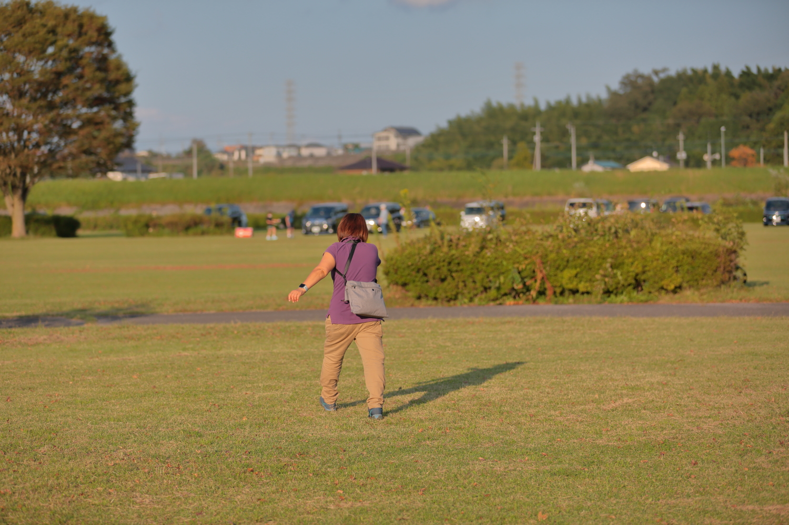
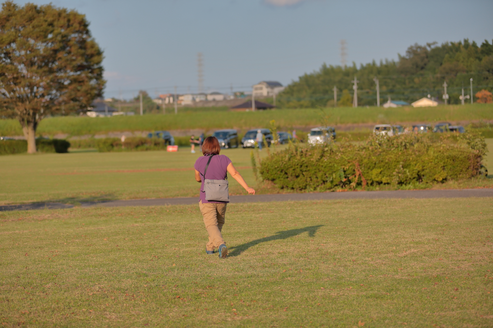

# mama_greenpark

<html>
<head>

<meta charset="UTF-8">
<meta http-equiv="Content-Type" content="text/html; charset=UTF-8">
<meta http-equiv="X-UA-Compatible" content="IE=EmulateIE10" />
<meta http-equiv="X-UA-Compatible" content="IE=edge">

<!--ここから上はお決まりの定型文です-->

<!--ここからが表現の書式などを決めるcssという部分-->

<link href="https://cdnjs.cloudflare.com/ajax/libs/lightbox2/2.7.1/css/lightbox.css" rel="stylesheet">

</head>

<body>

  モバイル端末をお使いの場合は、画面を横向きにすると
  より見やすくご覧頂けます。

    
<!--ここまでは定型文としてそのままコピペして再利用します—->

<!-—リンクの作り方、例
<a href="ここにリンク先のURLを入れる" target="_blank" rel="noopener noreferrer">新規タブで開く</a>-—>

<!-—ぱんくずリストの表示例-—>
<!--今回は未使用

<a href="https://torokoid.github.io/fts_home">Home</a>>同窓会

—->

<!—-表題の表示、背景黄色、流れ文字の例-->
<h1><marquee behavior="alternate">!!! 2021年10月3日(日)宝積寺グリーンパークのコスモス、ママおさんぽ !!!</marquee></h1>

<!--

-->

<!--QRコードの表示例-->

 アクセス用QRコード

                                    

<h3>コスモスはまだ７分咲きだけど、ママはごきげん ！</h3>

<!--

-->
                                    

<!-- フッタ -->
 <footer>
 Copyright 2021/10/03 S.Hada
 </footer>

<!--HPにさまざまなJavaScriptを呼び込むための書式-->

</body>

</html>
